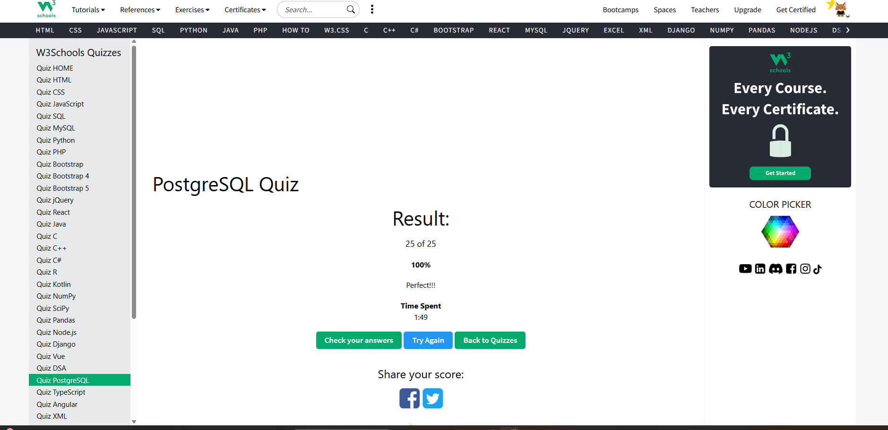
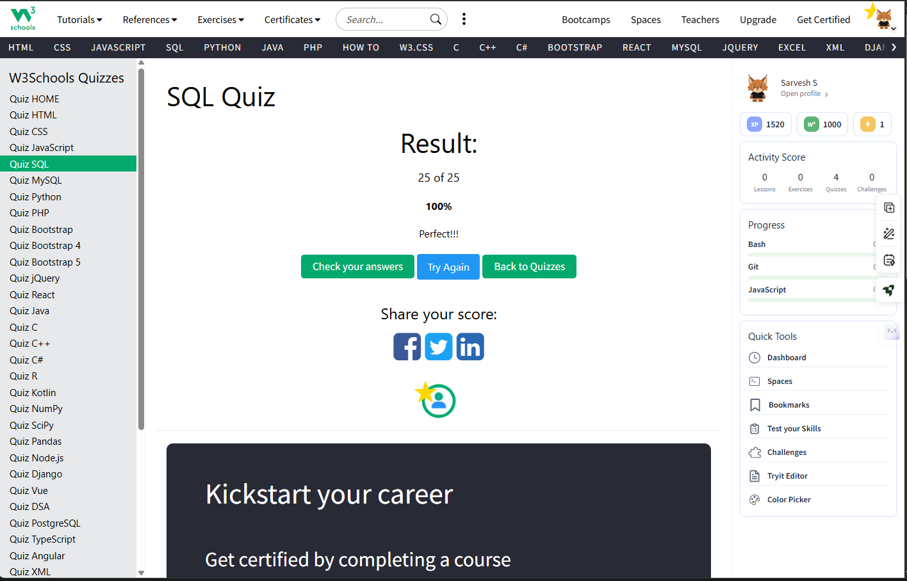

# Introduction to Database & Advanced Concepts

This repository contains my study materials and practice code for database concepts, ranging from basics to advanced topics like Triggers, Functions, and ODBC integration.

## Structure

### 1. [Basics](./basics)
- **[SQL_BASICS](./basics/SQL_BASICS)**: Core SQL operations (CRUD), table creation, and constraints.
- **[SQL_JOINS](./basics/SQL_JOINS)**: Understanding relationships between tables using INNER, LEFT, and RIGHT joins.

### 2. [Advanced Concepts](./advanced)
- **[SQL_FUNCTIONS](./advanced/SQL_FUNCTIONS)**: Built-in aggregate functions and custom User-Defined Functions (UDFs).
- **[SQL_TRIGGERS](./advanced/SQL_TRIGGERS)**: Automated database events for auditing and data integrity.
- **[ODBC](./advanced/ODBC)**: Database connectivity standards and implementation examples.

## 📝 Learning Objectives
- Design and implement relational database schemas.
- Master complex SQL queries for data retrieval and manipulation.
- Implement server-side logic using Stored Functions and Triggers.
- Understand and implement standard database connectivity through ODBC.

### Quiz Results

