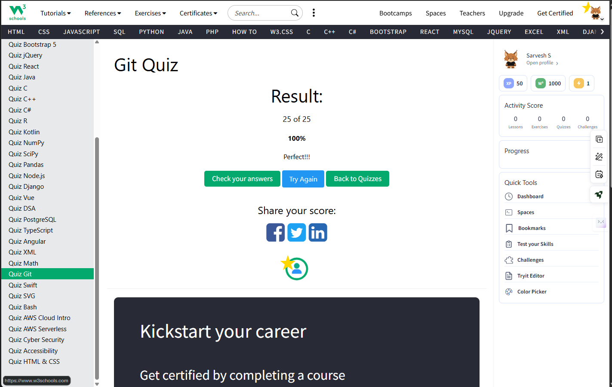

# Git Commands Module

## Description

This module showcases my learning and assessment progress for Git commands. For this module I used the W3Schools learning platform.

---

## Assessment Summary

* Lessons Completed
* Exercises Completed
* Quiz Completed

---
### Quiz Results

---
