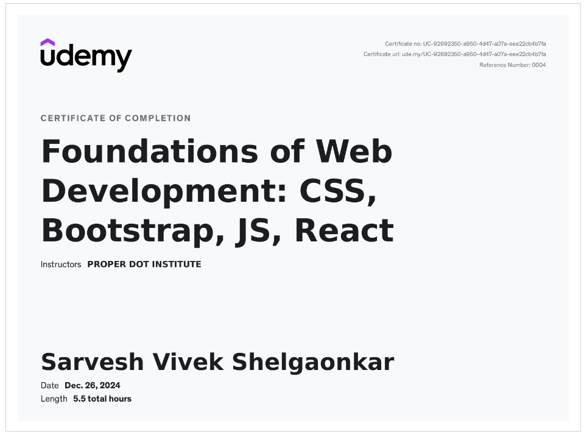
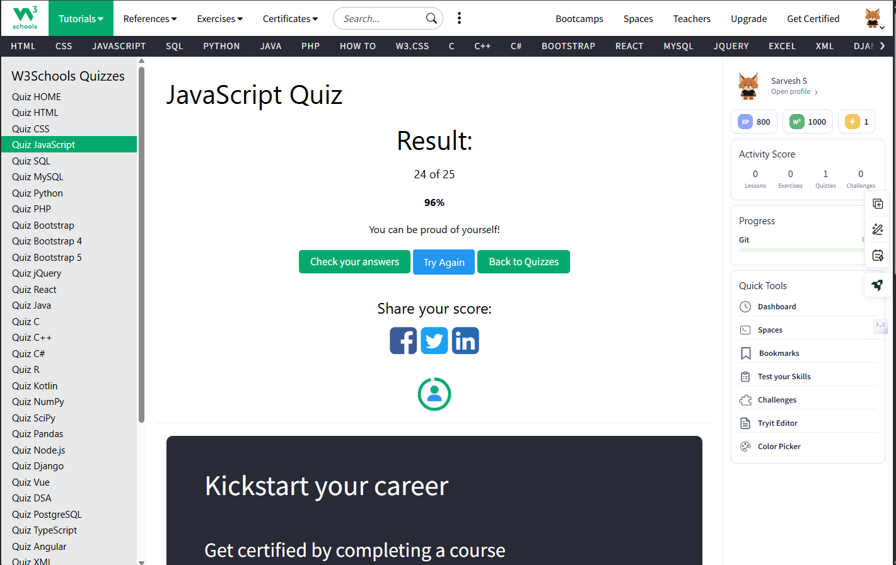

# JS Prep For Entrata:
## Learning Approach

I’ve developed my JavaScript skills through a mix of structured courses and hands-on practice:

* **Delta Batch (Apna College)** – Core JavaScript & Logic Building.
* **W3Schools** – Documentation & Syntax mastery.
* **YouTube Tutorials** – Modern web development practices.
* **Practical Projects** – Implementing concepts through hands-on coding.

## Concepts Covered
    
- Variables
- Data Types
- Operators
- Control Flow
- Loops
- Functions
- DOM Manipulation
- Events
- Strings
- Arrays
- Input Validation
- Error Handling
- API Handling (fetch, JSON processing)
- JavaScript Integration

## Assessment Method
### 1. To assess learning outcomes, I built some mini projects:

    1. **[Simon Game](./Projects/1)Simon%20Game)**
    2. **[Calculator](./Projects/2)Calculator)**

### 2. JavaScript MCQ + Coding Test + Certifications:
https://www.udemy.com/certificate/UC-92692350-a950-4d47-a07a-eee22cb4b7fa/

## References Links:
** https://github.com/Sarvesh-Shelgaonkar/Placement-Materials **

