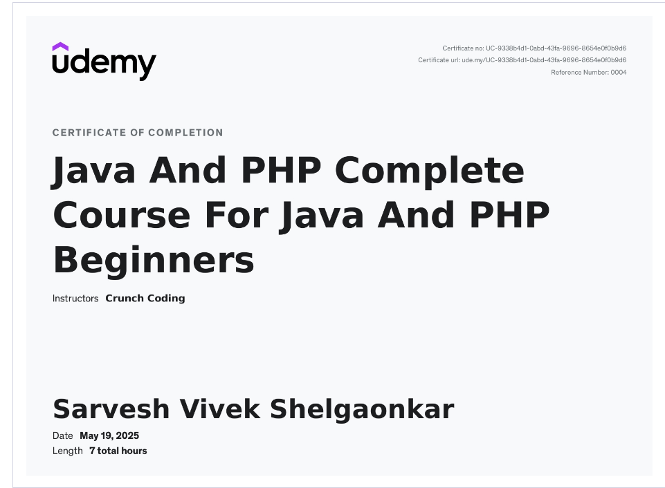

# PHP Development Modules

This directory contains a structured learning path for PHP development, covering everything from core syntax to advanced database integration and unit testing.

## Structure

### 1. Core Modules
- **[1. CORE_BASICS](./1.CORE_BASICS)**: Variables, Types, Operators, and Strings.
- **[2. CONTROL_FLOW](./2.CONTROL_FLOW)**: Logic, Decisions, and Loops.
- **[3. DATA_STRUCTURES](./3.DATA_STRUCTURES)**: Working with various Array types.
- **[4. FUNCTIONS_AND_MODULARITY](./4.FUNCTIONS_AND_MODULARITY)**: Reusable code and Lambdas.
- **[5. WEB_AND_FORMS](./5.WEB_AND_FORMS)**: Form handling, Sessions, and Routing.
- **[6. DATABASE_AND_STORAGE](./6.DATABASE_AND_STORAGE)**: PDO Database access and File logging.

### 2. Advanced PHP & Integration
- **[Advanced Concepts](./Advanced_Concepts)**: API, Namespaces, Magic Methods, and RegEx.
- **[PHP-Integration](./PHP-integration)**: Connecting PHP with other systems.

### 3. Testing with PHPUnit
- **[PHPUnit Practice](./PHPUnit)**: Automated testing examples using the PHPUnit framework to ensure code quality.

## Key Features
- **Theoretical Documentation**: Every module includes a `README.md` explaining the concepts.
- **Practical Examples**: Hands-on `examples.php` files with real-world themes (Gadgets, Cinema, Corporate, etc.).
- **Security Focused**: Demonstrations of Prepared Statements and XSS prevention.

**https://www.udemy.com/certificate/UC-9338b4d1-0abd-43fa-9696-8654e0f0b9d6/**
