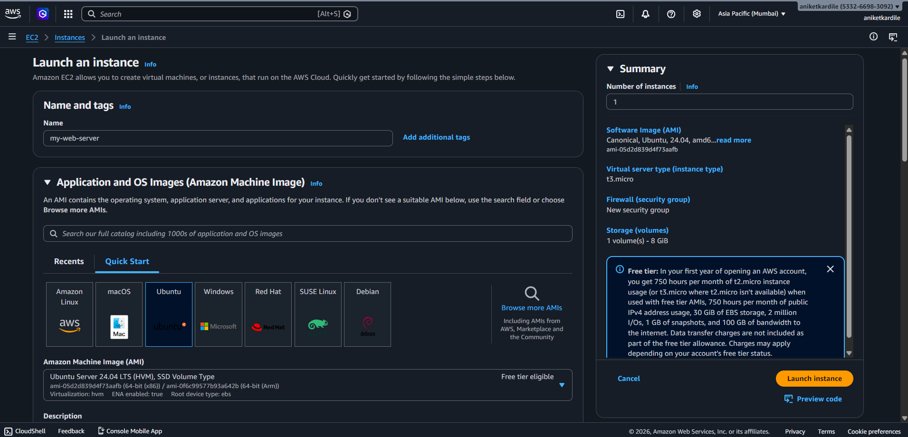
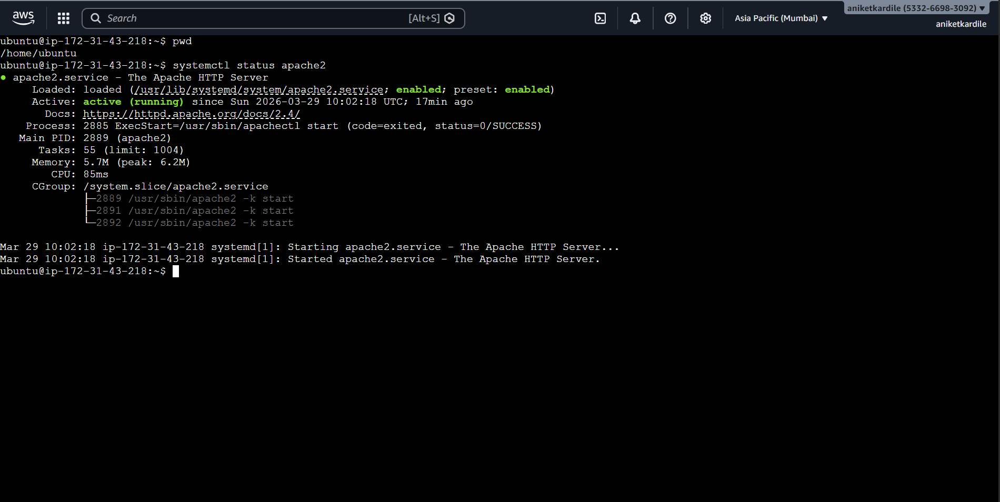
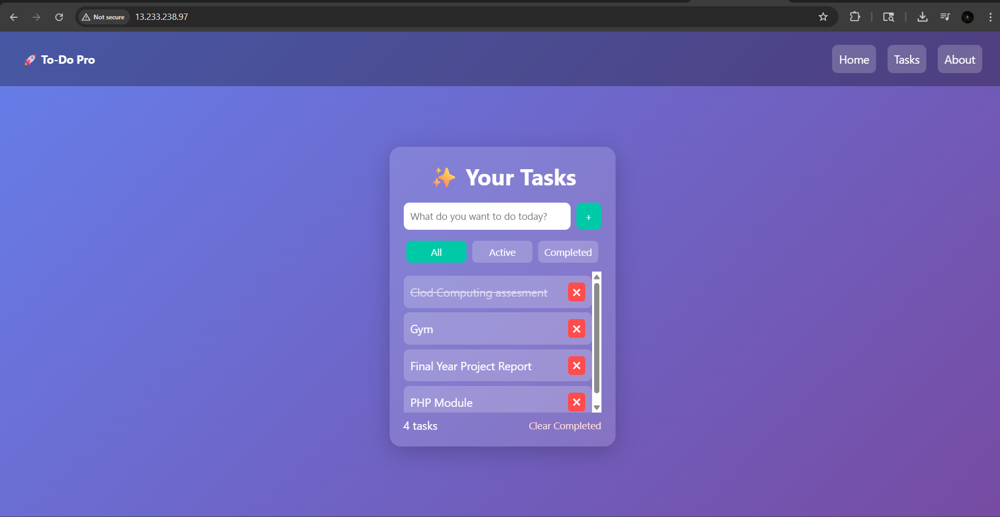

Documentation for deploying a To-Do List static website on AWS EC2.

# ☁️ AWS EC2 Static Website Deployment (To-Do List)

## 📌 Description
As part of the **Cloud Computing module**, I deployed a simple **To-Do List static website** on an AWS EC2 instance using the Apache web server.

This project demonstrates:
- Launching an EC2 instance
- Installing and configuring Apache
- Deploying a static website
- Accessing it via a public IP

---

## 🚀 Steps Performed

### 1. Create EC2 Instance
- Launched an Ubuntu-based EC2 instance from AWS.
- Configured security group to allow HTTP (port 80).



---

### 2. Login & Install Apache Server
- Connected to EC2 via SSH.
- Installed Apache server.

```bash
sudo apt update
sudo apt install apache2 -y
```

### 3. Move Project Files to Server Directory
Copied project files to Apache root directory:

```bash
sudo cp -r * /var/www/html/
```

### 4. Start & Enable Apache

```bash
sudo systemctl start apache2
sudo systemctl enable apache2
```



### 5. Access Website via Public IP



Website is now accessible from anywhere

## Tech Stack
- AWS EC2
- Ubuntu
- Apache2
- HTML, CSS, JavaScript

## Output
Successfully deployed a To-Do List web application accessible over the internet.