# Docker Assessment - Entrata Training Module

## Overview

This repository contains my Docker assessment artifacts.  
For learning this module, I used playgrounds and labs provided by KodeKloud.

## 1. Quiz Assessment

To evaluate my Docker learning, I completed a Docker quiz generated with the help
of Gemini.

Quiz Link: [Gemini Docker Quiz](https://gemini.google.com/share/bfedd98417b8)

**Result Screenshot**
- 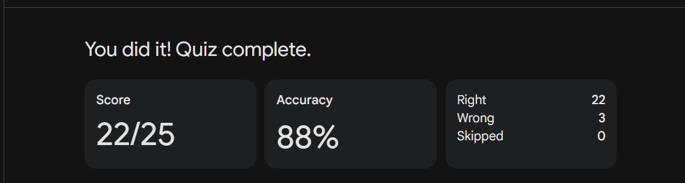

## 2. Implementation Assessment

### Problem 1: Container Lifecycle Management

**Question**  
Run an Nginx container (`nginx:1.14-alpine`) named `webapp`, expose it on port
`8080`, then stop, restart, and remove it.

**Concepts Covered**
- Docker image pull and run
- Port mapping
- Container lifecycle (`stop`, `start`, `rm`)

**Screenshots**
- 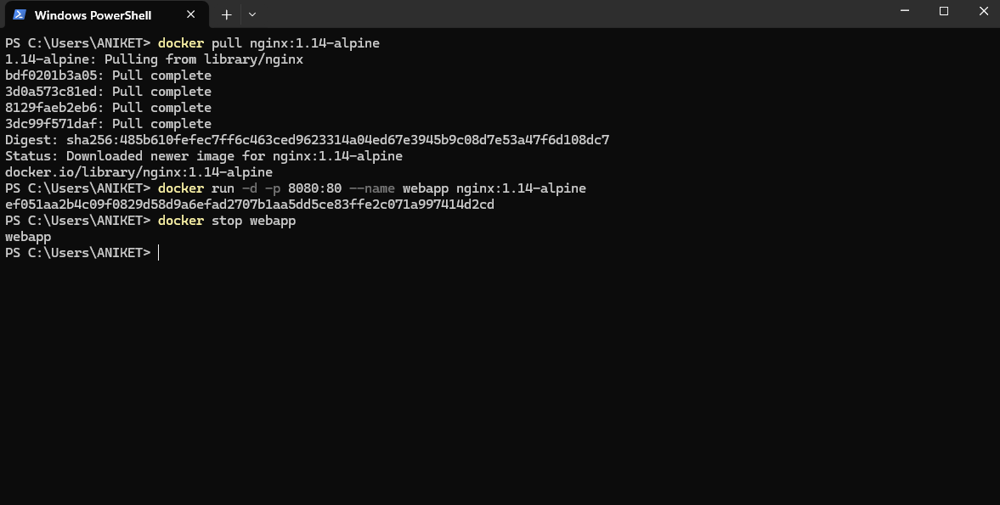
- 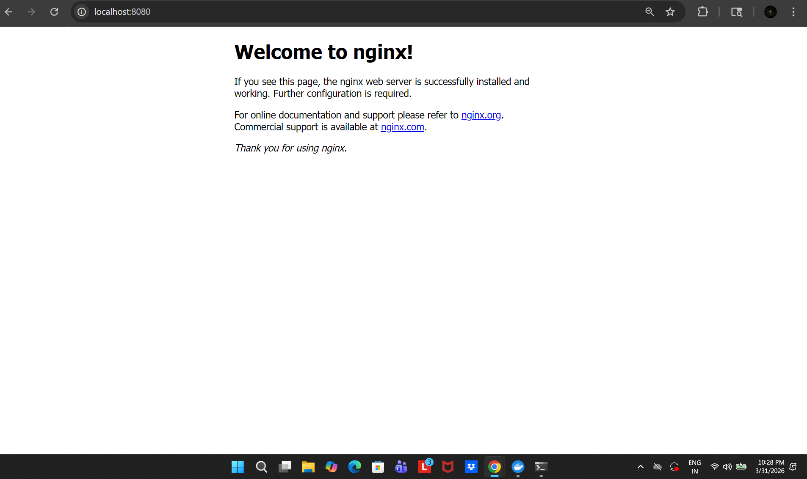

---

### Problem 2: Dockerfile - Node.js App

**Question**  
Create a Dockerfile for a Node.js application running on port `3000`.

**Concepts Covered**
- Dockerfile instructions (`FROM`, `WORKDIR`, `COPY`, `RUN`, `CMD`)
- Building a custom image
- Containerized Node.js app execution

**Screenshots**
- 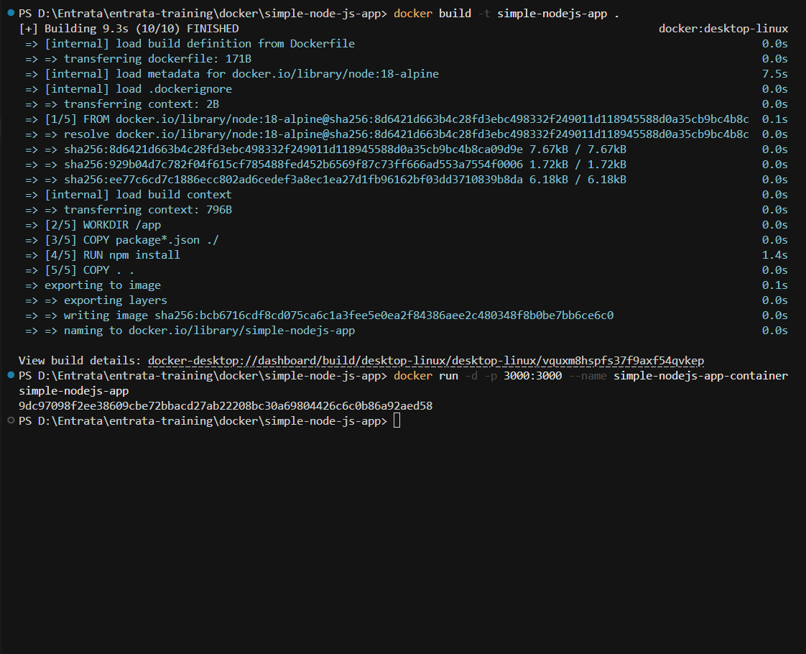
- 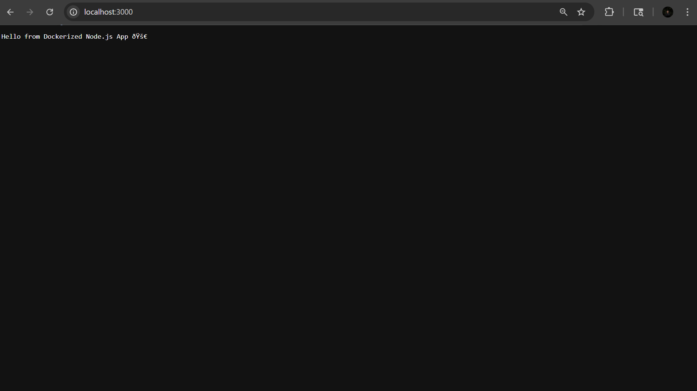

---

### Problem 3: Multi-Container App (Docker Compose)

**Question**  
Set up a Node.js backend with a PostgreSQL database using Docker Compose.

**Concepts Covered**
- `docker-compose.yml` service orchestration
- Environment variable-driven configuration
- Inter-service communication
- Volume

**Screenshots**
- 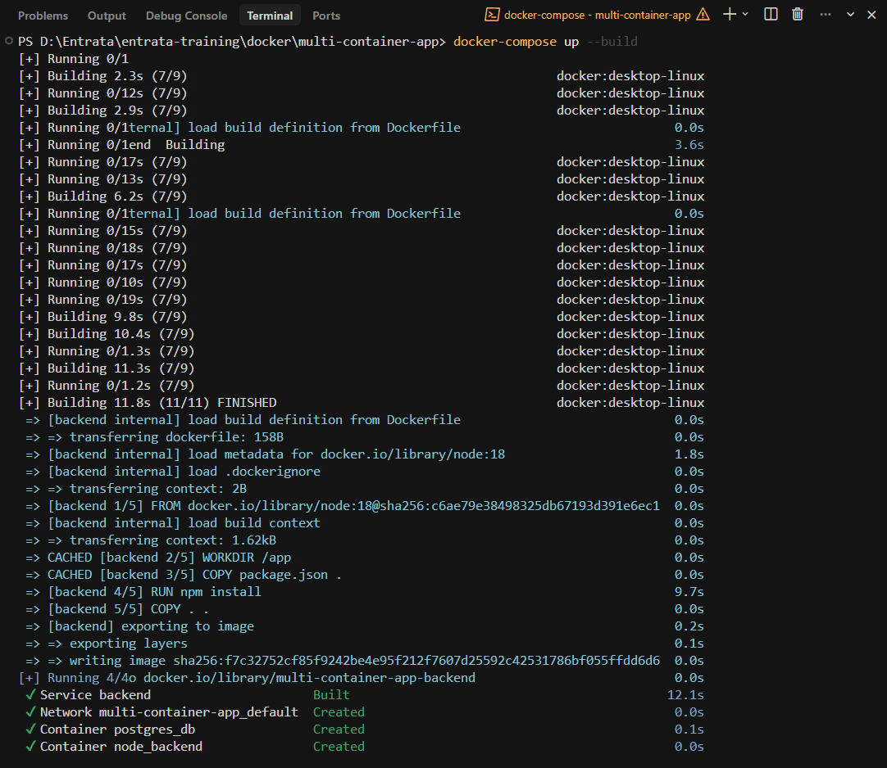
- 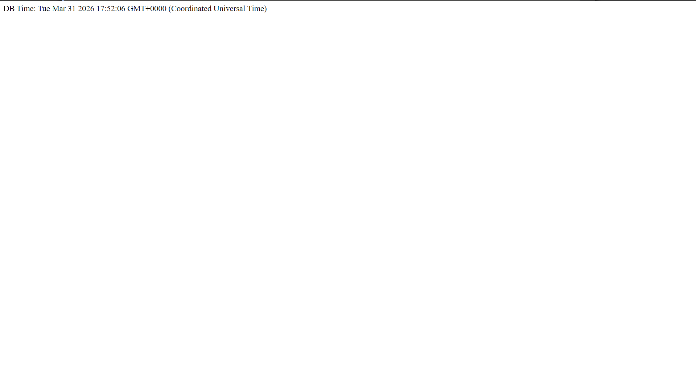

---

### Problem 4: Docker Networking

**Question**  
Create a custom network and allow two containers (`frontend` and `backend`) to
communicate.

**Concepts Covered**
- User-defined bridge networks

**Screenshots**
- 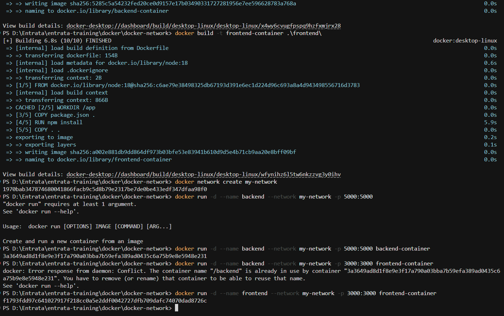
- 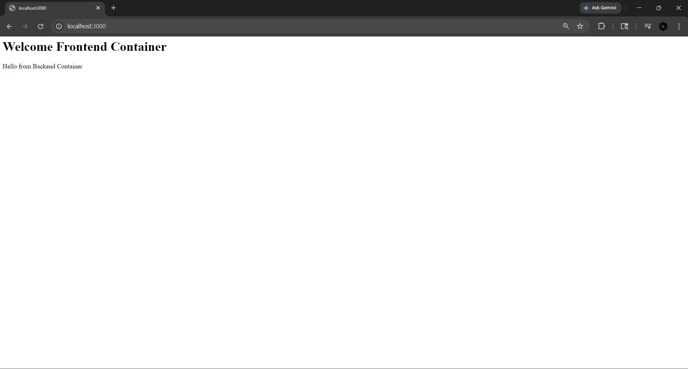

---

### Problem 5: Docker Hub and Registry

**Question**
Tag and push your Docker image to Docker Hub, then pull it.

**Concepts Covered**
- Docker Hub image workflow (tag, push, pull)

**Screenshots**
- 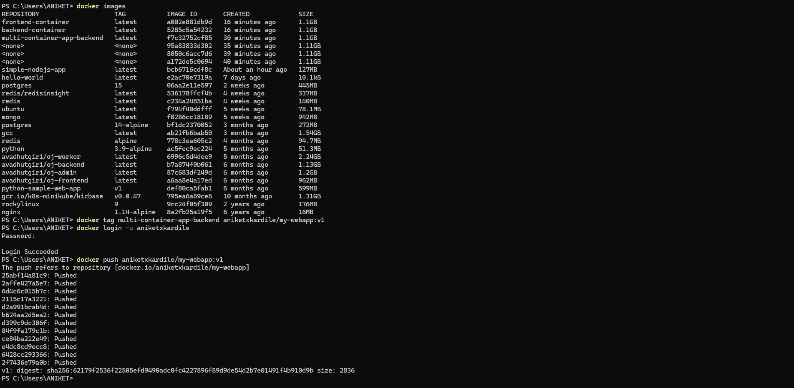
- 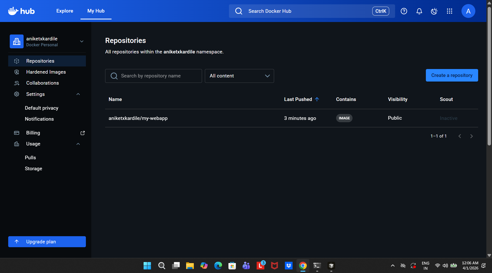
