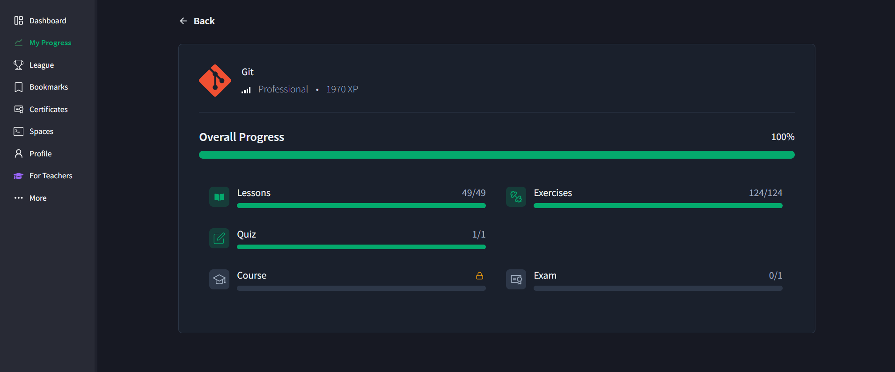
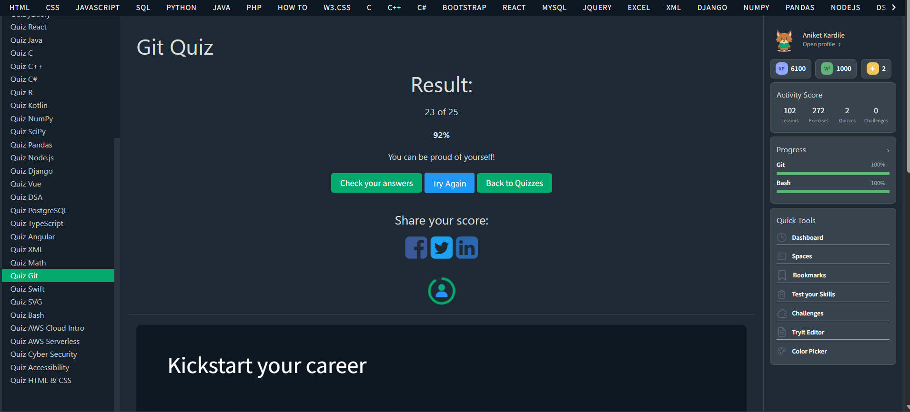

# 🔧 Git Commands Module

## 📌 Description

This module showcases my learning and assessment progress for Git commands. For this module I have used W3 Schools Learning Platform

---

## 📊 Assessment Summary

* ✅ Lessons Completed
* ✅ Exercises Completed
* ✅ Quiz Completed

---

## 📎 Proof of Work

### 📘 Overall Progress

### 📝 Quiz Results

---

