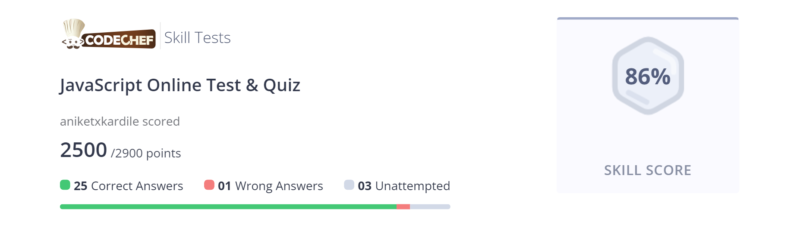

# JavaScript Module Assessment

## Learning Approach
I studied core JavaScript concepts through:
- YouTube tutorials
- Hands-on coding exercises

## Concepts Covered
    
- Variables
- Data Types
- Operators
- Control Flow
- Loops
- Functions
- DOM Manipulation
- Events
- Strings
- Arrays
- Input Validation
- Error Handling
- API Handling (fetch, JSON processing)
- JavaScript Integration

## Assessment Method
### 1. To assess learning outcomes, I built two mini projects:

    1. **Calculator**
    2. **Currency Converter**

### 2. JavaScript MCQ + Coding Test:

